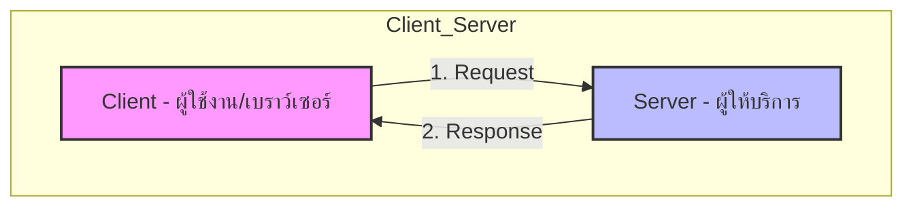

```mermaid
graph LR
    subgraph Client_Server
    direction LR
    A[Client - ผู้ใช้งาน/เบราว์เซอร์] -->|1. Request| B[Server - ผู้ให้บริการ]
    B -->|2. Response| A
    end

    style A fill:#f9f,stroke:#333,stroke-width:2px
    style B fill:#bbf,stroke:#333,stroke-width:2px
```
