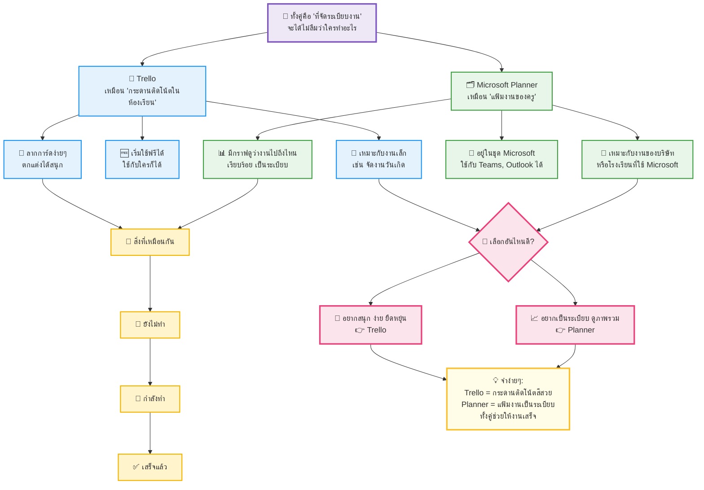

```mermaid
flowchart TB
    T["🎯 ทั้งคู่คือ 'ที่จัดระเบียบงาน'<br/>จะได้ไม่ลืมว่าใครทำอะไร"]

    T --> L["📌 Trello<br/>เหมือน 'กระดานติดโน้ตในห้องเรียน'"]
    T --> R["🗂️ Microsoft Planner<br/>เหมือน 'แฟ้มงานของครู'"]

    L --> L1["🎨 ลากการ์ดง่ายๆ<br/>ตกแต่งได้สนุก"]
    L --> L2["🆓 เริ่มใช้ฟรีได้<br/>ใช้กับใครก็ได้"]
    L --> L3["🎈 เหมาะกับงานเล็ก<br/>เช่น จัดงานวันเกิด"]

    R --> R1["📊 มีกราฟดูว่างานไปถึงไหน<br/>เรียบร้อย เป็นระเบียบ"]
    R --> R2["🏢 อยู่ในชุด Microsoft<br/>ใช้กับ Teams, Outlook ได้"]
    R --> R3["🏫 เหมาะกับงานของบริษัท<br/>หรือโรงเรียนที่ใช้ Microsoft"]

    L1 --> S["🤝 สิ่งที่เหมือนกัน"]
    R1 --> S

    S --> S1["📝 ยังไม่ทำ"]
    S1 --> S2["🏃 กำลังทำ"]
    S2 --> S3["✅ เสร็จแล้ว"]

    L3 --> Q{"🤔 เลือกอันไหนดี?"}
    R3 --> Q

    Q --> Q1["🎉 อยากสนุก ง่าย ยืดหยุ่น<br/>👉 Trello"]
    Q --> Q2["📈 อยากเป็นระเบียบ ดูภาพรวม<br/>👉 Planner"]

    M["💡 จำง่ายๆ:<br/>Trello = กระดานติดโน้ตสีสวย<br/>Planner = แฟ้มงานเป็นระเบียบ<br/>ทั้งคู่ช่วยให้งานเสร็จ"]
    Q1 --> M
    Q2 --> M

    classDef top fill:#EDE7F6,stroke:#7E57C2,stroke-width:3px,color:#333
    classDef trello fill:#E3F2FD,stroke:#2196F3,stroke-width:2px,color:#333
    classDef planner fill:#E8F5E9,stroke:#43A047,stroke-width:2px,color:#333
    classDef same fill:#FFF4CC,stroke:#F4B400,stroke-width:2px,color:#333
    classDef ask fill:#FCE4EC,stroke:#EC407A,stroke-width:3px,color:#333
    classDef memo fill:#FFFDE7,stroke:#FBC02D,stroke-width:3px,color:#333

    class T top
    class L,L1,L2,L3 trello
    class R,R1,R2,R3 planner
    class S,S1,S2,S3 same
    class Q,Q1,Q2 ask
    class M memo
```
