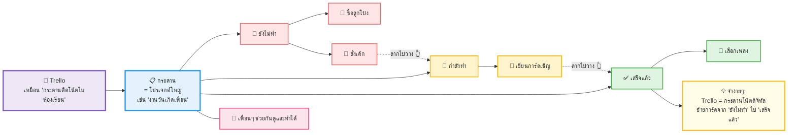

```mermaid
flowchart LR
    A["🎒 Trello<br/>เหมือน 'กระดานติดโน้ตในห้องเรียน'"]

    A --> B["📋 กระดาน<br/>= โปรเจกต์ใหญ่<br/>เช่น 'งานวันเกิดเพื่อน'"]

    B --> C["📝 ยังไม่ทำ"]
    B --> D["🏃 กำลังทำ"]
    B --> E["✅ เสร็จแล้ว"]

    C --> C1["🎈 ซื้อลูกโป่ง"]
    C --> C2["🎂 สั่งเค้ก"]

    D --> D1["💌 เขียนการ์ดเชิญ"]

    E --> E1["🎵 เลือกเพลง"]

    C2 -. "ลากไปวาง 👆" .-> D
    D1 -. "ลากไปวาง 👆" .-> E

    F["👫 เพื่อนๆ ช่วยกันดูและทำได้"]
    B --- F

    G["💡 จำง่ายๆ:<br/>Trello = กระดานโน้ตดิจิทัล<br/>ย้ายการ์ดจาก 'ยังไม่ทำ' ไป 'เสร็จแล้ว'"]
    E --> G

    classDef todo fill:#FFE5E5,stroke:#E57373,stroke-width:2px,color:#333
    classDef doing fill:#FFF4CC,stroke:#F4B400,stroke-width:2px,color:#333
    classDef done fill:#DFF5E1,stroke:#4CAF50,stroke-width:2px,color:#333
    classDef board fill:#E3F2FD,stroke:#2196F3,stroke-width:3px,color:#333
    classDef root fill:#EDE7F6,stroke:#7E57C2,stroke-width:3px,color:#333
    classDef friends fill:#FCE4EC,stroke:#EC407A,stroke-width:2px,color:#333
    classDef memo fill:#FFFDE7,stroke:#FBC02D,stroke-width:3px,color:#333

    class A root
    class B board
    class C,C1,C2 todo
    class D,D1 doing
    class E,E1 done
    class F friends
    class G memo
```
