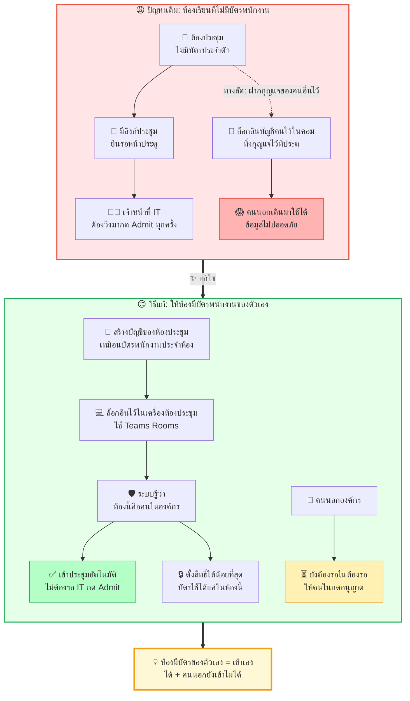

```mermaid
flowchart TD
    subgraph P["😩 ปัญหาเดิม: ห้องเรียนที่ไม่มีบัตรพนักงาน"]
        direction TB
        A["🏢 ห้องประชุม<br/>ไม่มีบัตรประจำตัว"] --> B["🚪 มีลิงก์ประชุม<br/>ยืนรอหน้าประตู"]
        B --> C["🧑‍💻 เจ้าหน้าที่ IT<br/>ต้องวิ่งมากด Admit ทุกครั้ง"]
        A -.->|"ทางลัด: ฝากกุญแจของคนอื่นไว้"| D["🔑 ล็อกอินบัญชีคนไว้ในคอม<br/>ทิ้งกุญแจไว้ที่ประตู"]
        D --> E["😱 คนนอกเดินมาใช้ได้<br/>ข้อมูลไม่ปลอดภัย"]
    end

    P ==>|"✨ แก้ไข"| S

    subgraph S["😊 วิธีแก้: ให้ห้องมีบัตรพนักงานของตัวเอง"]
        direction TB
        F["🪪 สร้างบัญชีของห้องประชุม<br/>เหมือนบัตรพนักงานประจำห้อง"] --> G["💻 ล็อกอินไว้ในเครื่องห้องประชุม<br/>ใช้ Teams Rooms"]
        G --> H["🛡️ ระบบรู้ว่า<br/>ห้องนี้คือคนในองค์กร"]
        H --> I["✅ เข้าประชุมอัตโนมัติ<br/>ไม่ต้องรอ IT กด Admit"]
        H --> J["🔒 ตั้งสิทธิ์ให้น้อยที่สุด<br/>บัตรใช้ได้แค่ในห้องนี้"]
        K["👤 คนนอกองค์กร"] --> L["⏳ ยังต้องรอในห้องรอ<br/>ให้คนในกดอนุญาต"]
    end

    S ==> Z["💡 ห้องมีบัตรของตัวเอง = เข้าเองได้ + คนนอกยังเข้าไม่ได้"]

    style P fill:#ffe5e5,stroke:#e74c3c,stroke-width:2px
    style S fill:#e5ffe9,stroke:#27ae60,stroke-width:2px
    style Z fill:#fff8d6,stroke:#f39c12,stroke-width:3px
    style E fill:#ffb3b3,stroke:#e74c3c
    style I fill:#b3ffc6,stroke:#27ae60
    style L fill:#fff0b3,stroke:#f39c12
```
